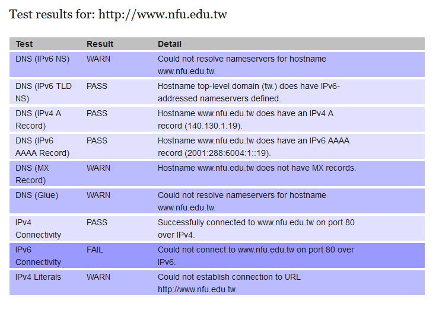

從前天下午大約兩點開始, 學校的 IPv6 路由就已經無法對外連線, 但對一般師生來說, 這似乎不是甚麼大不了的問題.

<!-- PELICAN_END_SUMMARY -->

因為 IPv6 網路協定, 在這裡就好像化外之物, 在乎的用戶並沒有很多.

希望查核 www.nfu.edu.tw 的 IPv6 是否連通, 可以使用 <https://ready.chair6.net/?url=www.nfu.edu.tw>.

</image>

由於 IPv6 connectivity 已經斷線超過 60 個小時, 因此過去兩天上課不得不僅依靠時斷時通的 IPv4 網路連線.

但也有好消息, 幾經波折, [Github Pages] 終於[支援 IPv6].

[支援 IPv6]: https://docs.github.com/en/pages/configuring-a-custom-domain-for-your-github-pages-site/managing-a-custom-domain-for-your-github-pages-site
[Github Pages]: https://pages.github.com/
[Github]: https://github.com
[Gitlab]: https://gitlab.com
[Gitlab 原始碼]: https://gitlab.com/gitlab-org/gitlab
[Waitress]: https://docs.pylonsproject.org/projects/waitress/en/latest/
[uwsgi]: https://uwsgi-docs.readthedocs.io/en/latest/
[Fossil SCM]: https://fossil-scm.org
[NGINX]: https://nginx.org
[Apache]: https://www.apachelounge.com/download/
[Pelican]: https://blog.getpelican.com/
[Markdown]: https://en.wikipedia.org/wiki/Markdown
[Blog]: https://en.wikipedia.org/wiki/Blog
[Leo Editor]: https://leoeditor.com/
[Brython]: https://brython.info/
